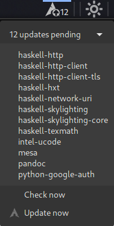

# Arch Linux Updater for cinnamon
## General Description

Arch Linux is a rolling release distribution and it is recommended to
perform full system upgrades regularly using the pacman upgrading system.

This panel applet for cinnamon helps you to be informed about
prospective updates. You can see which updates are pending and decide
when you whant to do the update.

The great idea for this applet had [Raphael
Rochet](https://github.com/RaphaelRochet/arch-update). He had build the
tool for the gnome shell and as I switched over to cinnamon, because I
couldn't accept that all possibilities of configuring of look and feel
of a desktop manager were taken away, I was missing the arch-update
tool. This is why I have adapted the tool for the Mint/Cinnamon
platform.

## How does it work

<dl>
<table border="0" width="100%"><tr>
<td width="80%" align="left">
The applet periodically checks whether packages need to be updated. If
there are such packages they will be listed and counted. The number of
outstanding updates is shown in the applet icon and the list is shown in
the applet menu. There you can initiate the update by clicking the
correspondent menu entry.
</td>
<td width="20%" align="center"></td></tr></table>
</dl>

## Installation

Go to [GitHub-Repository](https://github.com/p3fff/CinnamonArchLinuxUpdater.git) download the ZIP-file. Unpack the downloaded archive. You can decide where to install the applet.

    > # personal directory for your use only
    > mv <path-to-zip-content>/arch-updater@p3fff.de ~/.local/share/cinnamon/applets
   
    > # alternatively for all users
    > sudo mv <path-to-zip-content>/arch-updater@p3fff.de /usr/share/cinnamon/applets
    > sudo chown -R root:root /usr/share/cinnamon/applets/arch-updater@p3fff.de

Cinnamon Arch Linux Updater uses `checkupdates` to check for updates.
Therefore, you need to install `pacman-contrib`:

    > sudo pacman -S acman-contrib

Try running `checkupdates` in your terminal, if it gives you this error:

    ==> ERROR: Cannot fetch updates

you have to set the environment variable `CHECKUPDATES_DB` in one of
your provile scripts (more info on this issue here:
https://bbs.archlinux.org/viewtopic.php?id=223384):

    > export CHECKUPDATES_DB="$HOME"/tmpdb checkupdat

After that you can select the applet for one of your panels. If you are
using gnome-terminal for running the upgrade command which is set by
default (see configuration below) you have to install the corresponding
package:

    > pacman -S gnome-terminal

## Configuration

Normally everything is initially set up correctly. But you might want to
change the behavior a little bit.

### Update command

The most important setting in the applet configuration is the 'Command
to run to update packages.'. If you don't whant to use the
gnome-terminal you have to set a different terminal wich has to execute
the update command:

    sh -c  "sudo pacman -Syu ; echo Done - Press enter to exit; read "

### Enable update for all users (non system maintainer)

Normally only system maintainers are able to run the update command. If
'normal' users should do an update periodically you have enable it by
doing the following sequence.

Run a shell. Here you create the group and add all users to the group
who need to have the rights for updating. After that you add a new sudo rule
to give all users of the new group pac the right to execute the update
command (and only this command) with system administrator rights.

    > # add a group using for update rights
    > sudo groupadd -r pac
    > 
    > # add each user who should have the right for running the update command
    > sudo gpasswd -a <username> pac
    > 
    > # start the special editor for the sudo configuration
    > sudoedit /etc/sudoers

add the line

    # enable update command without typing password
    %pac    ALL = NOPASSWD: /usr/bin/pacman -Syu

or alternatively

    # enable update command with typing the personal user password
    %pac    ALL = /usr/bin/pacman -Syu

save your changes. Now all these users should be able to start the
command `/usr/bin/pacman -Syu`.
